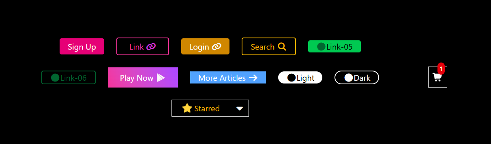

Button UI Showcase

This project is a modern button interface built using HTML, Tailwind CSS, and Font Awesome icons.
It demonstrates a variety of interactive buttons, hover animations, and icon integration — useful for learning or reusing UI components in web projects.

🚀 Features

🌈 Multiple Button Styles (filled, outlined, gradient, rounded, icon buttons)

🖱️ Interactive Hover Effects

🔄 Different Cursor States (progress, wait, pointer)

🧩 Font Awesome Icons for visual enhancement

🎮 Gradient Button Example with color transitions

🌙 Light/Dark Mode Buttons

⭐ Starred Section with Dropdown Icon

🛒 Cart Icon with Notification Badge

🧱 Positioning Example — Parent/Child container using relative & absolute positioning

🧰 Technologies Used

HTML5 – Page structure

Tailwind CSS – Styling and layout

Font Awesome 6.6.0 – Icons

